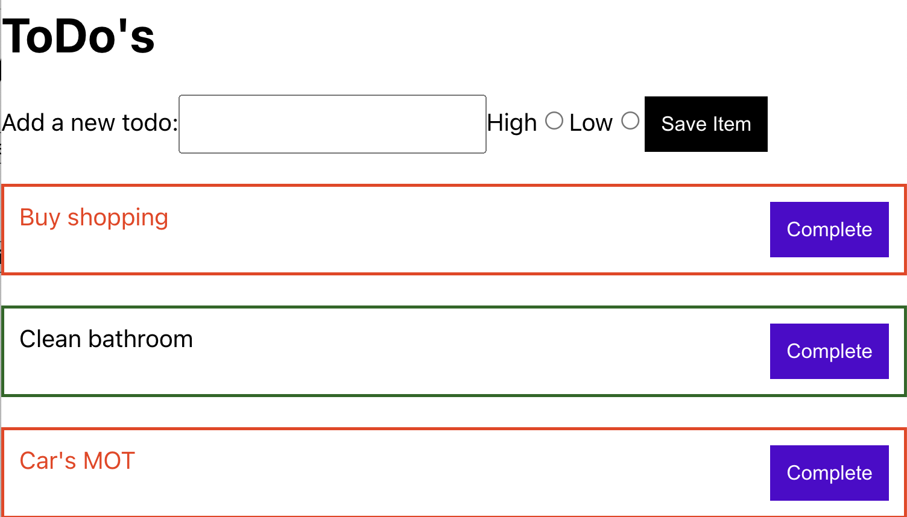

# Homework: ToDo List

## Learning Objectives

- Be able to create a basic React application
- Be able handle and display state
- Be able to use a simple form

## Brief

Your task is to create a ToDo list application that allows a user to save an item to a list which then renders on the page.

Use React to build a solution that looks like this:



## MVP

- Render a list of ToDos from an array of objects.
- Add the capability to add a new ToDo to the list.

Your todos array would look something like:

```js
[
  { id: 1, name: "Buy shopping" },
  { id: 2, name: "Clean bathroom" },
  { id: 3, name: "Car's MOT" },
];
```

## Extensions

- Allow the user to complete a ToDo (remove it)
- Add `radio` buttons (or a `select` if that proves tricky) to track the level of priority. You'll likely need to consult the MDN docs to figure out how they work. Refactor your state to capture this.
- Give the user visual feedback on what ToDos are high priority
